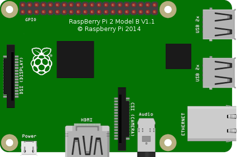

# Raspberry Pi 2 Model B

This is the base Nerves System configuration for the Raspberry Pi 2 Model B.

 [Image credit](#fritzing)

| Feature              | Description                     |
| -------------------- | ------------------------------- |
| CPU                  | 900 MHz quad-core ARM Cortex-A7 |
| Memory               | 1 GB DRAM                       |
| Storage              | MicroSD                         |
| Linux kernel         | 4.4.50 w/ Raspberry Pi patches  |
| IEx terminal         | HDMI and USB keyboard (can be changed to UART)   |
| GPIO, I2C, SPI       | Yes - Elixir ALE                |
| ADC                  | No                              |
| PWM                  | Yes, but no Elixir support      |
| UART                 | 1 available - ttyAMA0           |
| Camera               | Yes - via rpi-userland          |
| Ethernet             | Yes                             |
| WiFi                 | Requires USB WiFi dongle        |
| Bluetooth            | Not supported                   |

## Supported USB WiFi devices

The base image includes drivers and firmware for Ralink RT53xx
(`rt2800usb` driver), RealTek RTL8712U (`r8712u` driver) and
RealTek RTL 8192 (`rtl8192cu` driver) devices (e.g. EDImax USB WiFi dongles).

We are still working out which subset of all possible WiFi dongles to
support in our images. At some point, we may have the option to support
all dongles and selectively install modules at packaging time, but until
then, these drivers and their associated firmware blobs add significantly
to Nerves release images.

If you are unsure what driver your WiFi dongle requires, run Raspbian and configure WiFi
for your device. At a shell prompt, run `lsmod` to see which drivers are loaded.
Running `dmesg` may also give a clue. When using `dmesg`, reinsert the USB
dongle to generate new log messages if you don't see them.

[Image credit](#fritzing): This image is from the [Fritzing](http://fritzing.org/home/) parts library.
